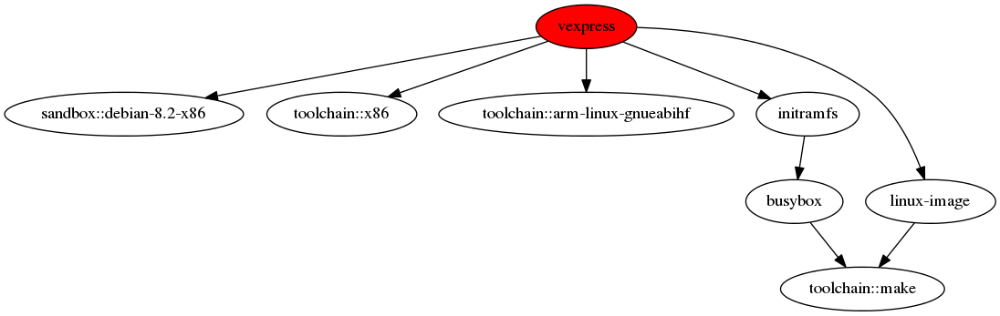

Build a demo project
********************

Prerequisites
=============

You should have Bob somewhere in your ``$PATH``. As the first step clone the
tutorial projects::

    $ git clone https://github.com/BobBuildTool/bob-tutorials.git
    $ cd bob-tutorials/sandbox

This tutorial will use the sandbox example that should work basically
everywhere. The next steps are all executed in the same directory.

Build release
=============

To see the packages that you can build type::

    $ bob ls -r
    /
    └── vexpress
        ├── initramfs
        │   ├── busybox
        │   └── toolchain::arm-linux-gnueabihf-rootfs
        ├── linux-image
        ├── sandbox::debian-x86_64
        └── toolchain::arm-linux-gnueabihf-toolchain

As you can see there is a single top-level package called ``vexpress``. This
demo project builds a QEMU image for the ARM Versatile Express machine. To
build the project simply do the following::

    $ bob build vexpress

This will fetch the toolchains and sources and will build the image locally in
the ``work`` directory. To speed up the build you can optionally add ``-j`` to
build packages in parallel. See the :ref:`bob build <manpage-build>` manpage
for all available options. Grab a coffee and after some time the build should
finish::

    ...
    >> vexpress
       BUILD     work/vexpress/build/1/workspace
       PACKAGE   work/vexpress/dist/1/workspace
    Build result is in work/vexpress/dist/1/workspace

Now you can run the example if you have QEMU installed::

    $ ./work/vexpress/dist/1/workspace/run.sh

Some words about the directory layout. The general layout is
``work/<package>/{src,build,dist}/#/`` where:

* ``<package>`` is the name of the package. In case of namespaces that might
  be several subdirectories, e.g. toolchain::arm-linux-gnueabihf will be built
  in ``work/toolchain/arm-linux-gnueabihf/...``.
* ``{src,build,dist}`` corresponds to the result of the step, e.g. ``src`` is
  where the checkout step is run.
* ``#`` is a sequential number starting from 1 that is increased for every
  variant of the package. New variants can emerge as recipes are updated.

Under the directory of a package you can find the following files and
directories:

* ``workspace/``: This is the directory where the step is executed and that
  holds the result.
* ``{checkout,build,package}.sh``: A wrapper script that executes this specific
  step. Running the script will execute this particular step again. If you call
  the script with ``shell`` as first argument a new shell is spawned with
  exactly the same environment as the step script would find.
* ``script``: The actual script that was computed from the recipe and the
  inherited classes. This is not directly executable because it expects the
  right environment and arguments.
* ``log.txt``: Logs of all runs.

Development build
=================

When executing ``bob build`` you build the requested packages in *release
mode*. This mode is intended for reproducible builds. The example already
employs a sandbox so that no host tools or paths are used. Though this is great
for binary reproducible builds it is inconvenient to debug and incrementally
change parts of the project.

For this purpose you can build the project in *development mode* via
:ref:`bob dev <manpage-dev>`. This mode basically does the same things but with
some important differences:

* Sandboxes are not used by default. The host should have the required
  development tools installed, for example make, gcc, perl and so on. You may
  still build inside a sandbox by adding the ``--sandbox`` option.
* Different directory layout to group sources, build and results of all
  packages: ``dev/{src,build,dist}/<package>/#/``.
* Incremental builds.
* Stable directory tree with incremental updates to the workspace.

In this mode it is possible to build packages, make some changes and rebuild.
If your environment has the right tools installed you should get the same
result as the release mode. But because sandboxes are not used it is still
possible to debug the created binaries. So let's build the kernel in
development mode::

    $ bob dev vexpress/linux-image
    >> vexpress/toolchain::arm-linux-gnueabihf-toolchain
       CHECKOUT  dev/src/toolchain/arm-linux-gnueabihf/1/workspace 
    >> vexpress/linux-image
       CHECKOUT  dev/src/linux/1/workspace 
    >> vexpress/toolchain::arm-linux-gnueabihf-toolchain
       BUILD     dev/build/toolchain/arm-linux-gnueabihf-toolchain/1/workspace
       PACKAGE   dev/dist/toolchain/arm-linux-gnueabihf-toolchain/1/workspace
    >> vexpress/linux-image
       BUILD     dev/build/linux-image/1/workspace
       PACKAGE   dev/dist/linux-image/1/workspace
    Build result is in dev/dist/linux-image/1/workspace
    Duration: 0:04:40.737003, 2 checkouts (0 overrides active), 2 packages built, 0 downloaded.

Notice that the development mode builds in a separate directory: ``dev``. The
numbering beneath the package name directory is kept stable. The numbers
represent only the currently possible variants of the package from the recipes.
If the ``checkoutSCM`` in the recipe is changed the old checkout will be moved
aside instead of using a new directory like in the release mode.

Suppose we want to make a patch to the kernel. This is as simple as to go to
``dev/src/linux/1/workspace``, edit some files and call Bob again to
rebuild, e.g.::

    $ vi dev/src/linux/1/workspace/init/main.c
    $ bob dev vexpress/linux-image

Bob will detect that there are changes in the sources of the kernel and make an
incremental build. For the sake of simplicity we might rebuild the top-level package
to test the full build::

    $ bob dev vexpress
    $ ./dev/dist/vexpress/1/workspace/run.sh

.. note::
   Touching (``touch ...``) source files will not have any effect. Bob detects
   changes purely by its content and not by looking on the file meta data.

Now that we have a kernel we might want to change the kernel configuration and
rebuild the kernel with the new one. From the output you can see that the
kernel was built in ``dev/build/linux-image/1/workspace``. We might edit the
``.config`` there directly but using ``make menuconfig`` is much more
convenient::

    $ ./dev/build/linux-image/1/build.sh shell -E
    $ make menuconfig

Now make and save your changes. Then rebuild the kernel::

    ...
      HOSTLD  scripts/kconfig/mconf
    scripts/kconfig/mconf  Kconfig
    configuration written to .config

    *** End of the configuration.
    *** Execute 'make' to start the build or try 'make help'.

    $ make -j $(nproc) bzImage
    $ exit

If you know how grab the kernel image directly out of the build tree and test
it. Alternatively you can rebuild the top-level package. ::

    $ bob dev vexpress
    ...
    >> vexpress/linux-image
       BUILD     skipped (unchanged input for dev/build/linux-image/1/workspace)
       PACKAGE   dev/dist/linux-image/1/workspace
    >> vexpress
       BUILD     dev/build/vexpress/1/workspace
       PACKAGE   dev/dist/vexpress/1/workspace
    Build result is in dev/dist/vexpress/1/workspace
    Duration: 0:00:01.643519, 0 checkouts (0 overrides active), 2 packages built, 0 downloaded.

and test the whole QEMU image. The choice is yours.

.. warning::
   Making changes to the build step tree is only detected by Bob in development
   mode. These changes should be properly saved in the sources or the recipe
   before moving on. Otherwise you risk that your changes are wiped out if Bob
   determines that a clean build is needed (e.g. due to recipe changes).

Out of tree builds
==================

The :ref:`manpage-dev` and :ref:`manpage-build` commands do not need to be
executed in the project directory directly. It is also possible to initialize
an external build directory with :ref:`manpage-bob-init`::

    $ bob init . /path/to/build/directory
    $ cd /path/to/build/directory
    $ bob dev vexpress

Each build directory can have its own :ref:`configuration-config-usr` that
overrides the defaults of the project.

Query SCM status
================

After you have developed a great new feature you may want to know which sources
you have touched to commit them to a SCM. Bob offers the :ref:`bob status
<manpage-bob-status>` command to show a list of SCM which are unclean. SCMs are
unclean in case they have modified files, unpushed commits, switched URLs or
non matching tags or commit ids.

The output looks like the following line::

    STATUS <status code> <scm path>

Status codes:

* ``U`` : Unpushed commits (Git only)
* ``u`` : unpushed commits on local branch (Git only)
* ``M`` : Modified sources.
* ``S`` : Switched. Could be different tag, commitId, branch or URL.
* ``O`` : Overridden. This Scm is overridden
  (:ref:`configuration-config-scmOverrides`). Depends on ``--show-overrides``.

Using IDEs with Bob
===================

You may want to use an IDE with Bob. At the moment Qt Creator and Eclipse are
supported. You can add more IDEs using :ref:`extending-generators` extension.
To generate project files the basic call is::

    $ bob project <genericArgs> <generator> <package> <specificArgs>

with ``genericArgs``:

* ``-n``: Do not build. Usually bob project builds the given package first to
  be able to collect binaries and add them to the IDEs run/debug targets.
* ``-D -c -e -E``: These arguments will be passed to bob dev and will also be
  used when compiling from IDE.

with ``generator``:

* ``eclipseCdt``: Generate project files for eclipse. Tested with eclipse MARS.
* ``qt-creator``: Generate project files for QtCreator. Tested with 4.0 and 4.1.

and ``package`` which is the name of a package to generate the project for.
Usually all dependencies for this package will be visible in the IDE. The
``specificArgs`` arguments are used by the generator itself. They differ from
generator to generator (see below).

QTCreator
---------

Because we have already built the sandbox tutorial it is very fast to generate
a Qt Creator project and open it::

    $ bob project qt-creator vexpress
    ...
    >> vexpress
       BUILD     skipped (unchanged input for dev/build/vexpress/1/workspace)
       PACKAGE   skipped (unchanged input for dev/dist/vexpress/1/workspace)
    Build result is in dev/dist/vexpress/1/workspace
    Duration: 0:00:00.847041, 0 checkouts (0 overrides active), 0 packages built, 0 downloaded.
    >> vexpress
       PROJECT   vexpress (qt-creator)
    $ qtcreator projects/vexpress/vexpress.creator

After loading the project Qt Creator will need quite some time to scan the
sources of the Linux kernel. You could add an ``--exclude linux-image`` to hide
this big package from Qt Creator if you do not intend to work on it from the
IDE.

QtCreator specific Arguments:

* ``--destination``: destination directory for the project files. Default is
  <workingDir>/projects/package_stack.
* ``--name``: name of the project. Default is packageName.
* ``-I``: additional include directories. They will only be added for indexer
  and will not change the buildresult.
* ``-f``: additional files. Normally only c[pp] and h[pp] files will be added.
  You can add more files using a regex.
* ``--kit``: kit to use for this project. You may want to use a different
  sysroot for includes and built-in preprocessor settings from your compiler. To
  tell QtCreator which toolchain to use you need to specify a kit. There are at
  least two options to create a kit: using the GUI or the sdkTools.

The following example shows how to create a cross compiling project for the
sandbox-tutorial and the included arm-toolchain: ::

        $ sdktool addTC \
            --id "ProjectExplorer.ToolChain.Gcc:arm" \
            --name "ARM-Linux-Gnueabihf" \
            --path "<toolchain-dist>/gcc-linaro-arm-linux-gnueabihf-4.9-2014.09_linux/bin/arm-linux-gnueabihf-g++" \
            --abi arm-linux-generic-elf-32bit
        $ sdktool addDebugger \
            --id "gdb:ARM32" \
            --name "ARM-gdb" \
            --binary <toolchain-dist>/gcc-linaro-arm-linux-gnueabihf-4.9-2014.09_linux/bin/arm-linux-gnueabihf-gdb
        $ sdktool addKit \
            --id "ARM_Linux" \
            --name "ARM Linux Gnueabi" \
            --devicetype Desktop \
            --toolchain "ProjectExplorer.ToolChain.Gcc:arm" \
            --sysroot <toolchain-dist>/gcc-linaro-arm-linux-gnueabihf-4.9-2014.09_linux/arm-linux-gnueabihf/libc/ \
            --debuggerid "gdb:ARM32"
        $ bob project qt-creator vexpress --kit ARM_LINUX

EclipseCdt
----------

Eclipse specificArgs:

* ``--destination``: destination directory for the project files. Default is
  <workingDir>/projects/package_stack.
* ``--exclude``: eclipse indexer sometimes runs OutOfMemory on large
  sourcetrees.  You can specify package names (or use a regular expression) to
  define packages excluded from build. This will stop indexer from indexing
  these packages.
* ``--name``: name of the project. Default is packageName.
* ``-I``: additional include directories. They will only be added for indexer
  and will not change the buildresult.

.. _tut-compile-viz:

Visualizing dependencies
========================

A dependency graph visualizes your package dependencies. Bob supports
two different graph types: 'dot' and 'd3'.

For the sandbox-tutorial the output of ::

      $ bob graph vexpress -t dot
      $ dot -Tpng -osandbox_graph.png graph/vexpress.dot

gives you the following image:

For more complex projects 'dot' graphs don't scale well. Therefore you
can create interactive graphs using the d3_ javascript library:

.. _d3: https://d3js.org/

Using ``bob graph`` with the basement-project_, enable node dragging and highlighting
the zlib packages: ::

      $ bob graph sandbox -H zlib.* -o d3.dragNodes=True

.. _basement-project: https://github.com/BobBuildTool/basement
.. raw:: html

    <iframe src="../_static/sandbox.html" height="500px" width="100%"></iframe>
